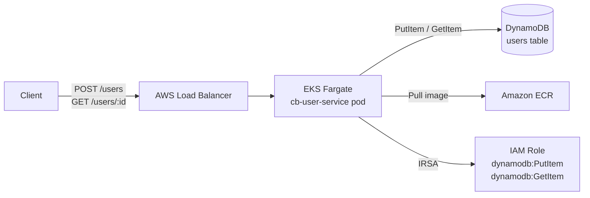

# cb-user-service

Spring Boot 3 REST API for user registration and retrieval, deployed on AWS EKS Fargate with DynamoDB, containerised via Docker and ECR, provisioned with Terraform.

## Architecture



## Project Structure

```
├── src/main/java/com/cb/userservice/
│   ├── UserServiceApplication.java
│   ├── controller/UserController.java       # POST /users, GET /users/{userId}
│   ├── service/UserService.java
│   ├── repository/UserRepository.java       # DynamoDB enhanced client
│   ├── model/
│   │   ├── User.java                        # DynamoDB entity
│   │   └── RegisterUserRequest.java         # Validated request DTO
│   └── config/
│       ├── DynamoDbConfig.java
│       └── GlobalExceptionHandler.java
├── src/main/resources/application.yml
├── Dockerfile                               # Multi-stage build (Corretto 21)
├── pom.xml
├── terraform/
│   ├── main.tf                              # VPC, ECR, EKS Fargate, DynamoDB, IAM, K8s resources
│   ├── variables.tf
│   ├── outputs.tf
│   └── envs/
│       ├── dev.tfvars
│       ├── staging.tfvars
│       └── prod.tfvars
└── .github/workflows/deploy.yml            # Build → ECR push → Terraform apply
```

## Prerequisites

- Java 21 (Amazon Corretto recommended)
- Maven 3.9+
- Docker
- [Terraform](https://developer.hashicorp.com/terraform/install) >= 1.6.0
- AWS CLI + credentials configured

## Local Run

```bash
# Set env vars
export AWS_REGION=us-east-1
export DYNAMODB_TABLE_NAME=cb-user-service-dev-users

# Build and run
mvn spring-boot:run
```

## Deploy

```bash
# 1. Build Docker image
docker build -t cb-user-service:latest .

# 2. Push to ECR
aws ecr get-login-password --region us-east-1 | \
  docker login --username AWS --password-stdin <account_id>.dkr.ecr.us-east-1.amazonaws.com

docker tag cb-user-service:latest <ecr_url>:latest
docker push <ecr_url>:latest

# 3. Provision infrastructure
cd terraform
terraform init
terraform apply -var-file=envs/dev.tfvars -var="image_tag=latest"
```

## Per-Environment Configuration

| Setting            | dev   | staging | prod  |
|--------------------|-------|---------|-------|
| app_replicas       | 1     | 2       | 3     |
| app_cpu            | 512   | 512     | 1024  |
| app_memory (MiB)   | 1024  | 1024    | 2048  |
| log_retention_days | 7     | 30      | 90    |

## API Reference

### Register User
```
POST /users
Content-Type: application/json

{
  "name": "Jane Doe",
  "email": "jane@example.com"
}
```
Response `201 Created`:
```json
{
  "userId": "550e8400-e29b-41d4-a716-446655440000",
  "name": "Jane Doe",
  "email": "jane@example.com",
  "createdAt": "2024-01-01T00:00:00Z"
}
```

### Fetch User
```
GET /users/{userId}
```
Response `200 OK` or `404 Not Found`

## CI/CD (GitHub Actions)

| Trigger              | Deploys to |
|----------------------|------------|
| Push to `main`       | dev        |
| Push to `release/**` | staging    |
| After staging        | prod (manual approval) |

### GitHub Secrets Required

| Secret               | Description                              |
|----------------------|------------------------------------------|
| `AWS_DEPLOY_ROLE_ARN`| IAM role ARN for OIDC federation         |
| `AWS_REGION`         | Target AWS region                        |
| `ECR_REPOSITORY`     | ECR repository name (e.g. cb-user-service-dev) |
